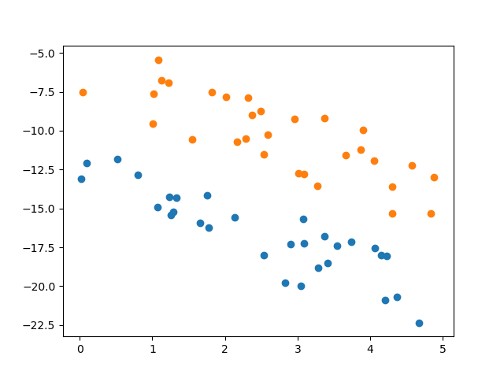

# SVM

## Overview

This is a simulation application of Support Vector Machine. The source code and inner logic comes from __Zhou Zhihua__'s *Machine Learning*.

## File description

### File - dataset.py

This file is a pseudo data set generator. It now can generate a completely correct dataset. You can run it to get a visualized bitmap like this.

### File - LinearSVM.py

This file is a linear SVM without any fault tolerant. You can run it and get the img below.

The blue dots in plot represent positive, while the green represent negative.

Red dots means this is a __Support Vector__.

## References

SMO algorithm

- __(Father of all)__ https://www.microsoft.com/en-us/research/publication/sequential-minimal-optimization-a-fast-algorithm-for-training-support-vector-machines/

You can get some valuable information from

- __(BEST RECOMMEND)__ https://blog.csdn.net/v_july_v/article/details/7624837
- https://blog.csdn.net/LY_ysys629/article/details/72980834
- https://blog.csdn.net/csqazwsxedc/article/details/71513197
- https://blog.csdn.net/huangynn/article/details/18553069
